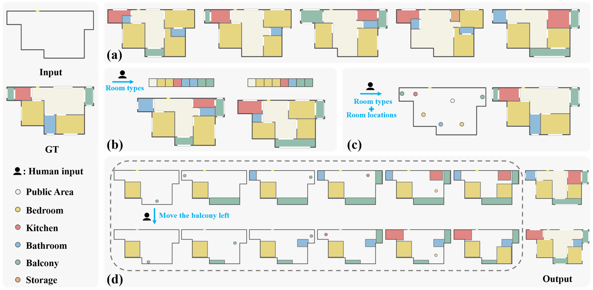

# IPLAN
[iPLAN: Interactive and Procedural Layout Planning (CVPR 2022)](https://arxiv.org/pdf/2203.14412.pdf)

Feixiang He, Yanlong Huang, He Wang

[project page](http://drhewang.com/pages/iplan.html) 

Layout design is ubiquitous in many applications, e.g. architecture/urban planning, etc, which involves a lengthy iterative design process. Recently, deep learning has been leveraged to automatically generate layouts via image generation, showing a huge potential to free designers from laborious routines. While automatic generation can greatly boost productivity, designer input is undoubtedly crucial. An ideal AI-aided design tool should automate repetitive routines, and meanwhile accept human guidance and provide smart/proactive suggestions. However, the capability of involving humans into the loop has been largely ignored in existing methods which are mostly end-to-end approaches. To this end, we propose a new human-in-the-loop generative model, iPLAN, which is capable of automatically generating layouts, but also interacting with designers throughout the whole procedure, enabling humans and AI to co-evolve a sketchy idea gradually into the final design. iPLAN is evaluated on diverse datasets and compared with existing methods. The results show that iPLAN has high fidelity in producing similar layouts to those from human designers, great flexibility in accepting designer inputs and providing design suggestions accordingly, and strong generalizability when facing unseen design tasks and limited training data.

## Authors
Authors
Deshan Gong, Zhanxing Zhu, Andy Bulpitt and He Wang

Deshan Gong, scdg@leeds.ac.uk

He Wang, h.e.wang@leeds.ac.uk, [Personal website](https://drhewang.com)

Project Webpage: http://drhewang.com/pages/diffcloth.html

## Citation (Bibtex)
Please cite our paper if you find it useful:

    @article{he2022iplan,
    title={iPLAN: Interactive and Procedural Layout Planning},
    author={He, Feixiang and Huang, Yanlong and Wang, He},
    journal={arXiv preprint arXiv:2203.14412},
    year={2022}
    }

## Contact
If you have any questions about the code, please contact me: Feixiang He(fxhe1992@gmail.com)

## License

Copyright (c) 2022, The University of Leeds, UK. All rights reserved.

Redistribution and use in source and binary forms, with or without modification, are permitted provided that the following conditions are met:

* Redistributions of source code must retain the above copyright notice, this list of conditions and the following disclaimer.

* Redistributions in binary form must reproduce the above copyright notice, this list of conditions and the following disclaimer in the documentation and/or other materials provided with the distribution.

THIS SOFTWARE IS PROVIDED BY THE COPYRIGHT HOLDERS AND CONTRIBUTORS "AS IS" AND ANY EXPRESS OR IMPLIED WARRANTIES, INCLUDING, BUT NOT LIMITED TO, THE IMPLIED WARRANTIES OF MERCHANTABILITY AND FITNESS FOR A PARTICULAR PURPOSE ARE DISCLAIMED. IN NO EVENT SHALL THE COPYRIGHT HOLDER OR CONTRIBUTORS BE LIABLE FOR ANY DIRECT, INDIRECT, INCIDENTAL, SPECIAL, EXEMPLARY, OR CONSEQUENTIAL DAMAGES (INCLUDING, BUT NOT LIMITED TO, PROCUREMENT OF SUBSTITUTE GOODS OR SERVICES; LOSS OF USE, DATA, OR PROFITS; OR BUSINESS INTERRUPTION) HOWEVER CAUSED AND ON ANY THEORY OF LIABILITY, WHETHER IN CONTRACT, STRICT LIABILITY, OR TORT (INCLUDING NEGLIGENCE OR OTHERWISE) ARISING IN ANY WAY OUT OF THE USE OF THIS SOFTWARE, EVEN IF ADVISED OF THE POSSIBILITY OF SUCH DAMAGE.
